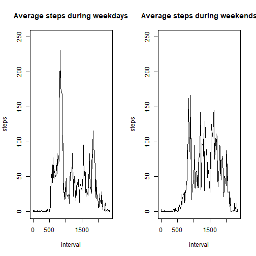

Peer-graded Assignment: Course Project 1 VK
===========================================

### Loading and preprocessing the data

Following is script which loads the data itself.


```r
data_raw <- read.csv("activity.csv")
```

Then, I make a copy of raw data into variable data, so that the raw data would not be lost.  
Also, I format date column to contain values formatted as date and filter out the NA values.


```r
data <- data_raw
data$date <- as.Date(as.character(data$date))
data <- data[!is.na(data$steps),]
```

### What is mean total number of steps taken per day?

In order to calculate the number of steps per day I use function aggregate and store the result in variable steps_per_day.


```r
steps_per_day <- aggregate(steps~date, data,sum)
```

Then, I load ggplot2 library and make the histogram which showstotal number of steps per date.

```r
library(ggplot2)
p <-ggplot(data, aes(date, steps))
p +geom_bar(stat = "identity")
```


Then, I calculate the mean and median of steps per day.


```r
mean(steps_per_day$steps)
```

```
## [1] 10766.19
```

```r
median(steps_per_day$steps)
```

```
## [1] 10765
```


### What is the average daily activity pattern?

First, I aggregate steps by interval using aggregate function and then make a plot.


```r
avg_steps_per_interval <- aggregate(steps~interval, data,mean)
plot(avg_steps_per_interval$interval, avg_steps_per_interval$steps, type="l", 
     main = "Average number of steps per interval", ylab="steps", xlab="interval")
```


Then, to find interval during which there appeared most steps, I use max
function and extract the interval.
That interval appears to be 830-835.


```r
max_nr_steps <- max(avg_steps_per_interval$steps)
data_nr_steps <- avg_steps_per_interval[avg_steps_per_interval$steps==max_nr_steps,]
data_nr_steps$interval
```

```
## [1] 835
```


### Imputing missing values

Following are scripts which do the following:

* make a copy of raw data;
* calculate the number of rows having missing values;
* replace the missing step information with the average for the partcular interval;
* aggregate steps by date for the new data set;
* mean and median of steps;
* plot the number of steps per day for the new data set;


```r
data_2 <- data_raw
data_2$date <- as.Date(as.character(data_2$date))
steps_NA <- is.na(data_2$steps)
steps_date_NA <- is.na(data_2$steps)
steps_interval_NA <- is.na(data_2$steps)
sum(steps_NA | steps_date_NA | steps_interval_NA)
```

```
## [1] 2304
```

```r
for (i in rownames(data_2))
{
    ## print(data_2[i,]$steps)
    ## print(data_2[i,]$steps)
    ## print(ddata_2[i,]$interval)
    if (is.na(data_2[i,]$steps))
    {
        corr_interval <- data_2[i,]$interval
        corr_step <- avg_steps_per_interval[avg_steps_per_interval$interval==corr_interval,]$steps
        data_2[i,"steps"] <- corr_step
      }
}

steps_per_day_2 <- aggregate(steps~date, data_2,sum)
mean(steps_per_day_2$steps)
```

```
## [1] 10766.19
```

```r
median(steps_per_day_2$steps)
```

```
## [1] 10766.19
```

```r
avg_steps_per_interval_2 <- aggregate(steps~interval, data_2,sum)
plot(avg_steps_per_interval_2$interval, avg_steps_per_interval_2$steps, type="l", 
     main = "Average number of steps per interval with \n missing values approximated",
     ylab="steps", xlab="interval")
```


### Are there differences in activity patterns between weekdays and weekends?

First I make a vector containing names of weekdays and create new factor column
identifing wh ether particular day is a weekday or a weekend.


```r
weekdays <- c("pirmadienis", "antradienis", "treèiadienis",
              "ketvirtadienis","penktadienis")
data_2$week_day <- factor(weekdays(data_2$date) %in% weekdays, 
                levels=c(FALSE, TRUE), labels=c("weekend", "weekday"))
```


Then, I make variables containing data about average number of steps during
weekdays and weekends.  
Then, I make a plot representing that data.  
It can be seen that on weekdays more steps are usually made.


```r
avg_steps_per_interval_weekday <- aggregate(steps~interval,
                                data=subset(data_2,week_day=="weekday"),mean)

avg_steps_per_interval_weekend <- aggregate(steps~interval,
                                            data=subset(data_2,week_day=="weekend"),mean)
par(mfrow=c(1,2))
plot(avg_steps_per_interval_weekday$interval, avg_steps_per_interval_weekday$steps, type="l", 
     main = "Average steps during weekdays",
     ylab="steps", xlab="interval", ylim=c(0,250))
plot(avg_steps_per_interval_weekend$interval, avg_steps_per_interval_weekend$steps, type="l", 
     main = "Average steps during weekends",
     ylab="steps", xlab="interval", ylim=c(0,250))
```




